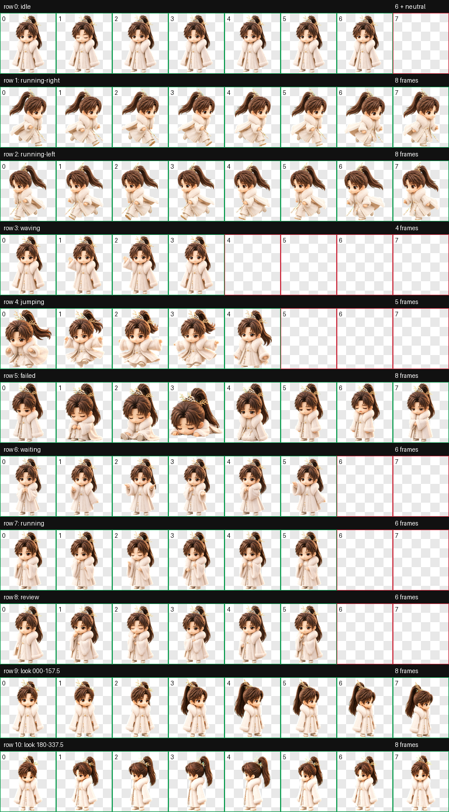

# Wangquan Fugui Codex Pet / 王权富贵 Codex 桌宠

An unofficial, fan-made animated Wangquan Fugui desktop pet for Codex, created from user-provided reference artwork. It uses the Codex pet v2 format with nine standard animation states and sixteen clockwise look directions.



## Install

1. Download `pet.json` and `spritesheet.webp`.
2. Create `~/.codex/pets/wangquan-fugui/`.
3. Copy both files into that folder.
4. Restart Codex if the pet does not appear immediately.

Expected layout:

```text
~/.codex/pets/wangquan-fugui/
├── pet.json
└── spritesheet.webp
```

## Pet format

- Sprite format: WebP with transparency
- Atlas: 8 columns × 11 rows
- Cell size: 192 × 208 pixels
- Sprite version: 2
- Animations: idle, run right, run left, wave, jump, failed, waiting, working, review, and 16 look directions

## Disclaimer

This is an unofficial fan-made project. It is not affiliated with or endorsed by the creators, publishers, producers, or rights holders of the original character or related works. No trademark or official logo is included.

## Credits

Created by Emon Xu with Codex.

---

## 中文介绍

这是一个非官方同人作品：基于用户提供的参考图，为 Codex 制作的「王权富贵」动态桌宠。桌宠采用 Codex v2 格式，包含九种标准动画状态和十六个顺时针观察方向。

## 安装方法

1. 下载 `pet.json` 和 `spritesheet.webp`。
2. 创建目录 `~/.codex/pets/wangquan-fugui/`。
3. 将两个文件复制到该目录中。
4. 如果桌宠没有立即出现，请重新启动 Codex。

安装后的目录结构：

```text
~/.codex/pets/wangquan-fugui/
├── pet.json
└── spritesheet.webp
```

## 宠物格式

- 精灵图：支持透明背景的 WebP
- 图集布局：8 列 × 11 行
- 单格尺寸：192 × 208 像素
- 精灵版本：2
- 动画：待机、向右移动、向左移动、挥手、跳跃、失败、等待、工作、检查，以及 16 个观察方向

## 免责声明

本项目为非官方同人作品，与原角色及相关作品的创作者、出版方、制作方或权利人无隶属或授权关系。项目中不包含商标或官方标识。

## 作者

由 Emon Xu 与 Codex 共同创作。
